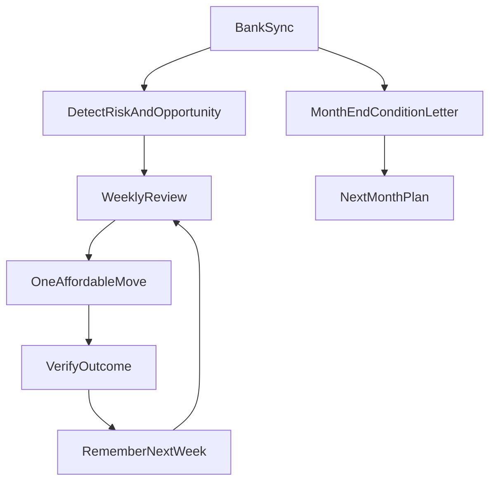

# Soverm PMF Todo — Win the Market

**Status:** Canonical source of truth for PMF scope (checkbox roadmap).  
**Not in this doc:** product implementation — pick a ship-order item when ready to build.

**ICP:** Paycheck-to-paycheck individuals  

**Core job:** Weekly check-in (how I did + what’s left + how to do better) and month-end personal accountant letter (financial condition).

**Product definition:** Soverm is the weekly check-in and monthly accountant letter for people living paycheck to paycheck — so they always know how they did, what’s left, and how to do better with it.

**Win condition:** Users say they open Soverm for the week, know what’s left, and treat the month-end letter like their accountant.

**North-star loop:**

```text
Sync → Detect risk/opportunity → Plain-English truth → One action → Verify outcome → Remember
```



**Success metrics (ship instrumentation with features):**

- [ ] Weekly active return (% who open Soverm in a given week after connect)
- [ ] Weekly review completion (saw how-you-did + what’s-left)
- [ ] Action taken rate (limit set / move intent / save / delay)
- [ ] Month-end condition letter open rate
- [ ] Qualitative: “I check Soverm on Sundays” / “I know if I’ll make it to payday”

**Existing code to leverage (do not reinvent):**

- [`server/utils/safeToSpend.js`](../server/utils/safeToSpend.js) — remaining / safe-to-spend math
- [`server/services/cashFlowForecast.js`](../server/services/cashFlowForecast.js) — runway / upcoming cash flow
- Bill calendar + forecast UI — upcoming bills for coach and weekly risk
- Trackers (spending cap + savings) + category soft limits — tools under the primary goal
- Needs Attention (`dashboardAttention.js`) — feed for weekly “one risk”
- Weekly digest job — elevate into ICP “truth letter”
- Action checklist + `parseSavingsAction.js` — closed-loop / surplus moves
- `FirstConnectCelebration.jsx` — extend for payday + buffer onboarding

---

## ID index (completeness)

| Area | IDs |
|------|-----|
| Foundations | P0.1–P0.6 |
| Weekly Review | W1–W10 |
| Payday / runway coach | R1–R4 |
| Closed-loop actions | A1–A4 |
| Subscription & bill defense | S1–S4 |
| Month-end condition letter | M1–M10 |
| Tier 2 love / retention | T2.1–T2.8 |
| Tier 3 defer | T3.1–T3.6 |
| Market packaging | G1–G6 |
| Ship order | steps 1–11 |

---

## Phase 0 — Foundations (unblock the ICP loop)

Work that makes weekly/monthly truth accurate. Do early; everything else depends on it.

- [x] **P0.1 Payday / income cadence detection**  
  Infer next payday and pay frequency from deposits (or let user confirm). Required for “what’s left until payday.”

- [x] **P0.2 Define “what’s left” (safe-to-spend) for paycheck-to-paycheck**  
  Clear formula: balances − known bills before next payday − reserved minimum buffer. Document in UI (“How we calculate this”).

- [x] **P0.3 Known bills & recurring load as first-class inputs**  
  Recurring charges + forecast bills feed weekly remaining and month-end condition (not buried only in Expense Analyzer).

- [ ] **P0.4 Single primary goal: “Get through the month”**  
  One default goal for ICP (buffer / don’t go negative / hit payday). Soft limits and caps are tools under this goal.

- [ ] **P0.5 Compassion + honesty tone system**  
  Copy rules: truth without shame; always one affordable next step; never fantasy budgets.

- [ ] **P0.6 Analytics events for PMF metrics**  
  Instrument weekly review views, action clicks, month-end opens, return visits.

---

## Phase 1 — Tier 1: PMF-critical (must win)

### 1A. Weekly Review (primary habit)

Dedicated surface (and/or digest) — **one screen, one verdict, one action.** Not a dashboard of tabs.

- [x] **W1. Weekly Review page / home module**  
  Primary post-login destination for ICP (or clear CTA from dashboard).

- [x] **W2. “How you did this week” block**  
  Plain English: spent this week vs last week / vs typical; call out 1–2 categories that drove the week.

- [x] **W3. “What’s left” block**  
  Safe-to-spend / runway until next payday (and optionally until month-end). Show confidence / assumptions.

- [x] **W4. “One risk” block**  
  Single highest-priority risk: upcoming bill, category near soft limit, low buffer, spending-cap warning, large txn.

- [x] **W5. “One better move” block**  
  One recommended action constrained by remaining money (hold / delay / set limit / move $Y if surplus / protect rent).

- [ ] **W6. Soft limits + spending cap progress inside weekly story**  
  Surface limit status in the weekly narrative, not only on Expense Analyzer rows.

- [ ] **W7. Needs Attention → weekly story feed**  
  Attention items roll into W4; dismissing/acting updates the weekly verdict.

- [x] **W8. Week boundary definition**  
  Consistent week window (e.g. Mon–Sun in `APP_TIMEZONE`); label clearly in UI.

- [x] **W9. Empty / first-week states**  
  Honest onboarding when <7 days of data: what we can/can’t say yet; still show bills + what’s left if possible.

- [x] **W10. “Check your week” ritual CTA**  
  Dashboard / push / email entry points timed for end-of-week or post-payday.

### 1B. Payday / runway coach

- [x] **R1. “Will I make it to payday?” verdict**  
  Fine / Tight / At risk — with why (bills, spend pace, buffer).

- [x] **R2. 14–30 day bill calendar integrated into coach**  
  Upcoming bills affect remaining and risk (reuse / elevate existing forecast + bill calendar).

- [x] **R3. Pace check**  
  “At this week’s spend rate, you’ll have $X left by payday” (or shortfall).

- [x] **R4. Confirm / edit payday**  
  User can correct inferred payday; persists and improves coach.

### 1C. Closed-loop actions (advice → outcome)

- [x] **A1. Action model tied to weekly + insight actions**  
  Each action has status: suggested → accepted → done / skipped / dismissed.

- [x] **A2. Outcome verification**  
  Later check whether spend dropped, transfer appeared, subscription still active, limit held.

- [x] **A3. Follow-up in next weekly review**  
  “Last week you set a Dining limit — here’s how it went” / “You skipped X — still relevant?”

- [ ] **A4. Actions → savings / buffer when relevant**  
  If surplus exists, one-tap path to move money toward buffer/goal (build on existing savings-action parsing).

### 1D. Subscription & bill defense

- [x] **S1. Price-increase / new recurring detection**  
  Flag when a recurring charge rises or a new subscription appears.

- [x] **S2. Duplicate / forgotten trial heuristics**  
  Call out likely waste with confidence + “review with Soverm.”

- [x] **S3. Cancel vs keep decision flow**  
  Chat or structured prompt: keep / cancel / watch — logged as an action with follow-up.

- [x] **S4. Bill defense in weekly risk + month-end letter**  
  Don’t silo only under Expense Analyzer → Recurring.

### 1E. Month-end financial condition letter (accountant climax)

- [x] **M1. Month-end Condition Report page + shareable/email version**  
  Triggered at calendar month close (and available anytime as “This month so far”).

- [x] **M2. Income vs spending summary**  
  Broke even / surplus / dug a hole — plain English + dollars.

- [x] **M3. Where money went (top drivers)**  
  Top 3 categories that mattered; link to drill-down, not a full chart dump as the hero.

- [x] **M4. Bills & subscriptions load**  
  Fixed obligations vs flexible spend; % of income if income known.

- [x] **M5. Buffer / emergency posture**  
  Even if tiny: days of runway, “one surprise away” honesty.

- [x] **M6. Progress vs last month**  
  Better / worse / flat on spend, buffer, recurring load.

- [x] **M7. Condition grade**  
  Stable / Tight / At risk — with short why (accountant tone).

- [x] **M8. Plan for next month**  
  2–3 concrete moves affordable with their real numbers.

- [x] **M9. Month-end notification / email**  
  “Your monthly accountant letter is ready.”

- [x] **M10. History of past month letters**  
  Re-read prior months (builds “personal accountant” relationship).

---

## Phase 2 — Tier 2: Love & retention multipliers

- [x] **T2.1 Weekly “truth letter” digest (email/push)**  
  3 bullets: what changed, what’s at risk, one action. Habit without requiring login. (Elevate existing weekly digest job into ICP voice.)

- [x] **T2.2 Digest deep-link into Weekly Review**  
  Open app already on the right week section / action.

- [x] **T2.3 Optional “before you spend” check**  
  Lightweight judgment: fine / blows category limit / risks rent or payday. Opt-in; not full budgeting.

- [x] **T2.4 Memory that compounds**  
  Remember payday, problem categories, goals, past actions, tone preferences; reflect in week 4+ copy (“as we talked about…”).

- [ ] **T2.5 Streak / ritual reinforcement (light)**  
  “You’ve checked in 4 weeks in a row” — careful, not gamified shame.

- [x] **T2.6 Chat grounded in weekly/monthly context**  
  General chat defaults to this week’s remaining + open actions + month condition — not generic finance Q&A.

- [ ] **T2.7 Soft-limit coaching loop**  
  When near/over limit mid-week: push into weekly move; month-end reflects whether limits helped.

- [x] **T2.8 Onboarding for paycheck-to-paycheck**  
  First-run: connect bank → confirm payday → optional one goal (buffer) → first “what’s left” within minutes. (Extend FirstConnectCelebration.)

---

## Phase 3 — Tier 3: Later / non-wedge (do not prioritize for PMF)

Keep listed so they don’t distract Phase 1–2. Build **only after** the weekly/monthly loop is measurably loved.

- [ ] **T3.1 Household / partner mode**  
  Shared view, shared bills — high value, high trust/UX cost. After solo loop is loved.

- [ ] **T3.2 Heavier Expense Analyzer as primary product**  
  Analyzer stays a drill-down tool, not the home habit.

- [ ] **T3.3 Net-worth / investments framing**  
  Wrong lead for ICP; defer.

- [ ] **T3.4 Complex multi-goal systems**  
  After one “get through the month / build buffer” goal works.

- [ ] **T3.5 More charts / vanity polish without loop impact**  
  Only if it improves weekly/monthly comprehension.

- [ ] **T3.6 Generic AI CFO branding expansion**  
  Brand follows the weekly/monthly accountant job, not the reverse.

---

## Phase 4 — Market-winning packaging (distribution + trust)

PMF needs retention *and* a clear reason to choose Soverm.

- [x] **G1. Landing rewrite around ICP job**  
  Lead with weekly check-in + month-end accountant letter; demote generic “insights/charts.”

- [x] **G2. Comparison vs Rocket Money / bank apps / spreadsheets**  
  Own: remaining-money coaching + weekly ritual + month-end condition (not just cancel subs).

- [x] **G3. Trust path for anxious users**  
  Read-only, Plaid, disconnect, what we see — already strong; tie to “we help you make it to payday.”

- [x] **G4. Free tier that delivers the weekly loop**  
  Don’t gate the habit that creates love; gate depth (history, extra chat, advanced defense).

- [x] **G5. Activation checklist**  
  Connected → payday confirmed → first weekly review seen → first action taken → first month letter.

- [ ] **G6. Win narrative / case studies**  
  Collect 5 stories: “Soverm told me I’d be short before Friday” / “month letter made me cancel X.”

---

## Suggested ship order (execution sequence)

Use this as the build queue when starting implementation:

1. [x] P0.1–P0.3 (payday, what’s left, bills as inputs)
2. [x] W1–W5 + W8–W9 (Weekly Review MVP)
3. [x] R1–R4 (payday coach wired into weekly)
4. [x] M1–M8 (month-end letter MVP)
5. [x] A1–A3 (closed-loop actions)
6. [x] S1–S3 (bill/subscription defense)
7. [x] T2.1–T2.2 + M9 (digest + month-end notify)
8. [x] T2.4, T2.6, T2.8 (memory, grounded chat, ICP onboarding)
9. [x] T2.3 (before-you-spend)
10. [x] G1–G5 (packaging + activation)
11. [ ] T3.* only after weekly/monthly loop is measurably loved

---

## Explicit non-goals until PMF

- Building more analyzer tabs before Weekly Review exists
- Optimizing for high-income “optimizer” personas
- Feature parity with full budgeting suites (YNAB-style)
- Shipping AI chat features that ignore remaining money and open actions

---

## Definition of “we won” (early)

You are winning when paycheck-to-paycheck users say:

1. “I open Soverm to see how my week went.”
2. “I know what I have left and what to do with it.”
3. “The month-end letter feels like my accountant.”
4. They’d be upset if Soverm disappeared.

Until those are true, treat everything else as secondary.
